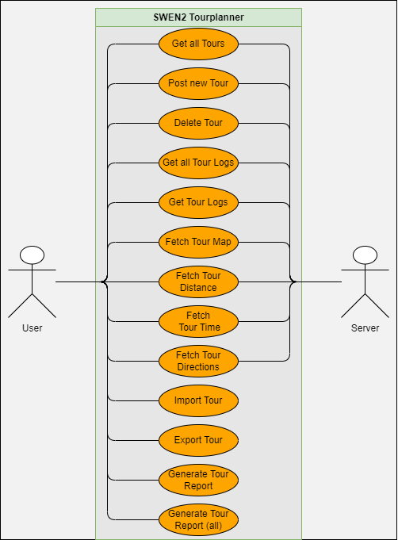
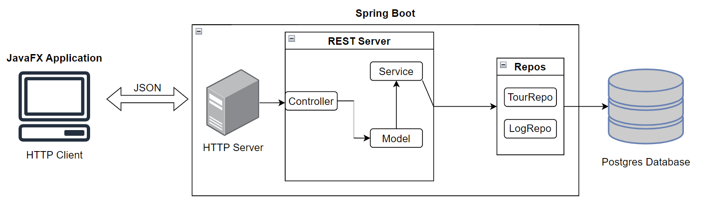
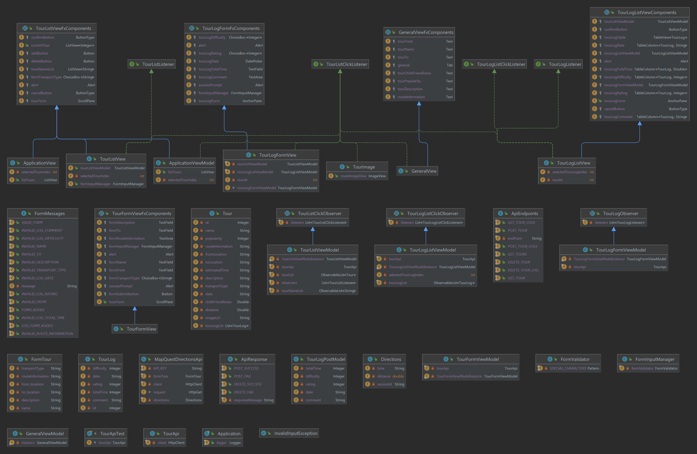

# Dokumentation

## Use Case Diagram

## App Architecture

## Class Diagram

## Backend Communication

Für die Backendkommunikation werden zwei APIs verwendet.
 

### TourApi

Die Tour API kommuniziert mit dem Backend Server und führt CRUD-Operationen.
Sie verwendet Apaches HTTP-Client und Jacksons Object Mapper zum deserialisieren.

Die Tour Api kümmert sich um die Tours und TourLogs und implementiert get/post
und delete Funktionen.

### Mapquest Api

Die Mapquest Api ist für die Route und das Bild der Route zuständig. Sie verwendet ebenfalls
Apaches HTTP-Client. Die API-Responses werden dann manuell mit einer Funktion geparsed und
weitergegeben.

## ViewModel Layer

Die ViewModels sind die Schnittstellen zwischen unserer View/UI und den APIs. Sie führen
sämtliche Arten von Logik aus und kümmern sich auch um die Datenspeicherung. Sie kommunizieren
bei Änderungen mit anderen Komponenten und können so sicherstellen, dass die richtigen Daten
dargestellt werden.

### Kommunikation zwischen den Komponenten

Für die Kommunikation zwischen den einzelnen Views miteinander wurde das Observer/Listener
Pattern verwendet. In diesem Fall sind bestimmte ViewModels Observer und die Views Listener.
Die ViewModels benachrichtigen alle Views, die sich registriert haben und übergeben in manchen Fällen
die neuen Daten. Ein ViewModel kann auch mehrere Datensätze beobachten und eine View kann sich bei mehreren
Observern anmelden.

## Unit Tests

### Lessons learned
- Die Integration eines Protokollierungsframeworks (log4j) hat enorm dabei geholfen, Laufzeitinformationen zu erfassen
und Fehler effektiv zu diagnostizieren. Nächstes Mal werden wir so ein Framework früher einsetzen um von Anfang Bugs
erkennen zu können.
- Umfassendes Unit-Testing hat die Korrektheit unseres Codes gewährleistet und hat stark dazu beigetragen, mit
Sicherheit sagen zu können, dass der code funktioniert.
- Rechtzeitig beginnen und gegen Ende einer Abgabe Stress ersparen
- Git Conflicts sind aufwendig, aber können mit geeigneten Vorbeugemaßnahmen weitgehend verhindert werden: 
  - Commits klein und fokussiert halten
  - In separaten Branches arbeiten
  - Regelmäßig lokalen Branch aktualisieren
### Time Tracking
| Date           | Time | Comment                                |
|----------------|------|----------------------------------------|
|                |      | Set up database                        |
|                |      | Docker Setup                           |
|                |      | Create GitHub-Repository               |
|                |      | Set up Springboot                      |
|                |      | Setting up OR-Mapping Library          |
|                |      | Setting up MapQuest/Static Map API     |
|                |      | log4j                                  |
|                |      | Create tour                            |
|                |      | Delete tour                            |
|                |      | Validate user-input                    |
|                |      | Create tour-logs                       |
|                |      | Delete tour-logs                       |
|                |      | Unique feature                         |
|                |      | Frontend-Design                        |
| 17.06          | 7    | Report-generation                      |
| 17.06 - 18.06  | 8    | Import/Export JSON Files               |
| 18.06          | 2    | Last Unit Tests                        |
| /              | 20   | Bugfixing, small adjustments, Protocol |
| <b>Overall</b> |      |                                        |

### VCS link

#### Frontend
https://github.com/israeltshilumbaFHTW/TourPlannerFrontend
#### Backend
https://github.com/israeltshilumbaFHTW/TourPlannerBackend